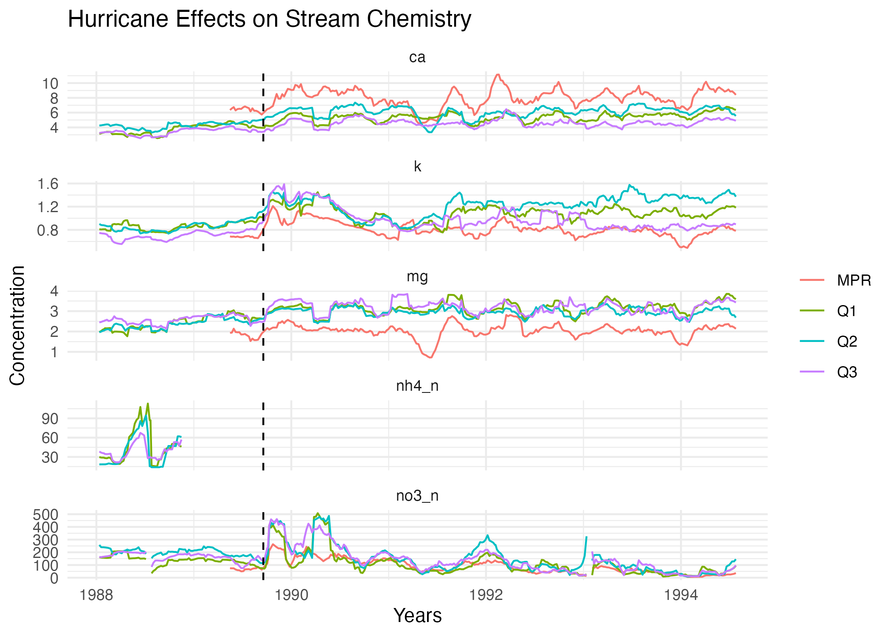

# Reproducing a graph: Hurricane effects on stream chemistry
This project is a recreation of figure 3 from Schaefer et al. (2000) investigating the effects of Hurricane Hugo on water chemistry in four streams in Bisley, Puerto Rico. 

## Contributor

Isabella Segarra (University of California, Santa Barbara- Masters of Environmental Data Science)

## Contents

-   [data](https://github.com/IsabellaSegarra/eds214-project/tree/7aad82372929f8eacbe066818c4500fe4b7bc392/data): Contains the raw data files.
-   [docs](https://github.com/IsabellaSegarra/eds214-project/tree/7aad82372929f8eacbe066818c4500fe4b7bc392/docs): Contains the rendered analysis paper as an HTML. 
-   [figs](https://github.com/IsabellaSegarra/eds214-project/tree/7aad82372929f8eacbe066818c4500fe4b7bc392/figs): Contains the final data visualization and flowchart.
-   [outputs](https://github.com/IsabellaSegarra/eds214-project/tree/7aad82372929f8eacbe066818c4500fe4b7bc392/outputs): Contains the intermediate (e.g. cleaned data) and final dataframes.
-   [paper](https://github.com/IsabellaSegarra/eds214-project/tree/7aad82372929f8eacbe066818c4500fe4b7bc392/paper): Contains the analysis Quarto markdown file.
-   [R](https://github.com/IsabellaSegarra/eds214-project/tree/7aad82372929f8eacbe066818c4500fe4b7bc392/R): Contains the code for cleaning raw data, processing data further, environment installation, functions, and plotting.
-   [scratch](https://github.com/IsabellaSegarra/eds214-project/tree/26b7ee0e2a7f9276ef303fb06f5bd2e4ff8d12c5/scratch): This includes scratch files. 

## Flow chart 
{width=20%}

## How to access data

The data is available through the Environmental Data Initiative <https://portal.edirepository.org/nis/mapbrowse?packageid=knb-lter-luq.20.4923064> from the USDA Forest Service.

## How the analysis works
In order to replicate figure 3 from Schaefer et al. 2000, I first imported the raw data and changed column titles. Following cleaning the data, I filtered the data by stream site and by the time frame of the study. After this process, I joined the stream data into one dataset. The figure visualized the average of stream nutrient concentrations over a time window of 9-weeks for six years. In order to reflect this in the data, we produced a function that inputs concentration and dates and returns a column with the average concentrations. Finally, the stream water chemistry data was plotted as a line graph. 

## Citations

Schaefer, Douglas. A., William H. McDowell, Fredrick N. Scatena, and Clyde E. Asbury. 2000. “Effects of Hurricane Disturbance on Stream Water Concentrations and Fluxes in Eight Tropical Forest Watersheds of the Luquillo Experimental Forest, Puerto Rico.” Journal of Tropical Ecology 16 (2): 189–207. <https://doi.org/10.1017/s0266467400001358>.
